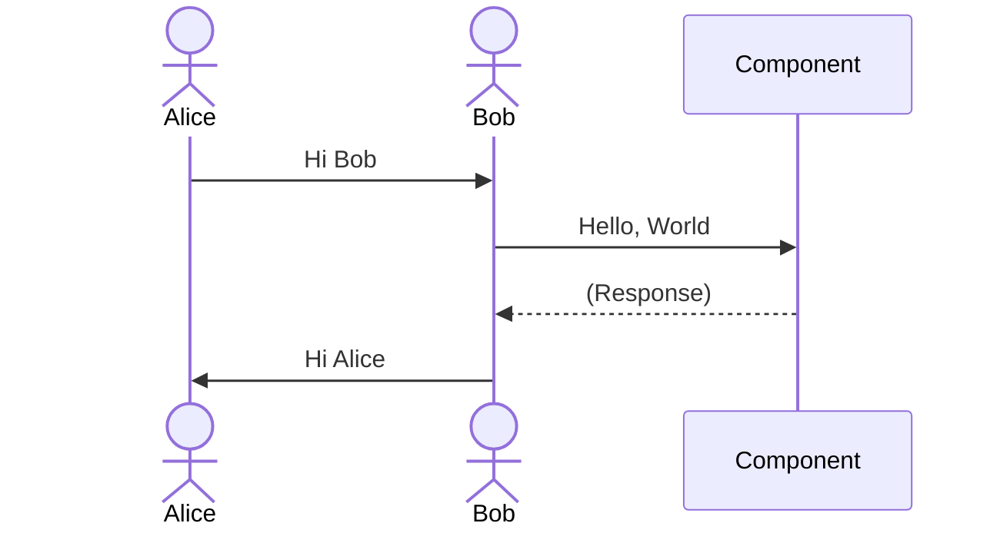

# mermaid

mermaid example

## sequence diagram

```mermaid
sequenceDiagram
    actor alice as Alice
    actor bob as Bob
    participant x as Component

    alice ->> bob: Hi Bob
    bob ->> x: Hello, World
    x -->> bob: (Response)
    bob ->> alice: Hi Alice
```
